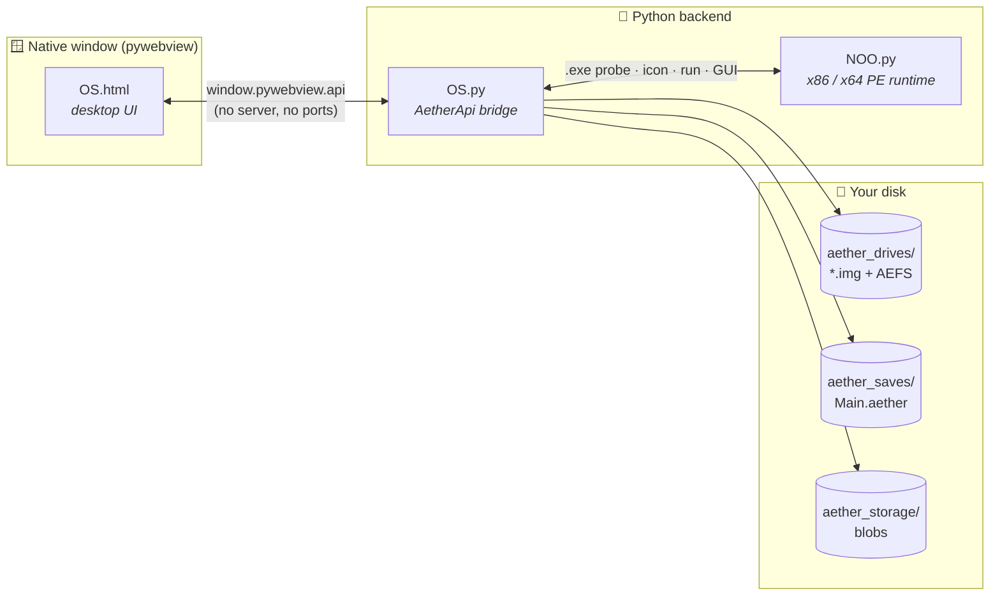

<div align="center">

# ✦ AetherOS ✦
### Desktop Edition

**A desktop environment in a native window that can also run Windows programs, with no Windows needed.**

<br>


<br>


<br>

[**Quick start**](#-quick-start) ·
[**Features**](#-features) ·
[**How it works**](#-how-it-works) ·
[**Files**](#-whats-in-the-box) ·
[**NOO engine**](#-the-noo-engine) ·
[**Bridge API**](#-bridge-api)

</div>

---

## ✨ Features

<table>
<tr>
<td width="50%" valign="top">

### 🖥️ A real desktop
Opens as a **native window**. It uses Edge WebView2 on Windows and WebKitGTK
(or Qt) on Linux. It isn't a browser tab and doesn't run a local server.

### 💾 Virtual drives
Creates sparse `.img` disk images of up to **8 GB**. Each one holds its own
small filesystem (**AEFS**), so files you save to a drive use that drive's
space. It also shows how much space each kind of file uses.

### 🔁 Save states
Saves the **whole OS state** atomically, with an automatic backup. If a save
file is damaged, the OS loads the last good one instead.

</td>
<td width="50%" valign="top">

### 🪟 Runs `.exe` files
Uses the bundled **NOO** engine to show a program's **real icon**, run console
programs, and display Win32 GUI programs as windows inside the desktop.
Everything is pure Python.

### 🌐 Web and downloads
Includes a built-in browser fetcher and real downloads into your
`Downloads` folder. Downloads never overwrite an existing file.

### 📄 Documents and WebAssembly
Reads text from **PDF** files (optional `pypdf`), converts **DOCX** to HTML
using only the standard library, and runs **WebAssembly** modules (optional
`wasmtime`).

</td>
</tr>
</table>

---

## 🚀 Quick start

```bash
# 1 · install everything (safe to re-run: it never deletes or reinstalls)
python3 install.py            # Windows:  py install.py

# 2 · launch
./AetherOS.sh                 # Windows:  double-click AetherOS.bat
python3 OS.py                 # …or run it directly
```

> [!IMPORTANT]
> Keep **`OS.html`** (the desktop UI) in the same folder as `OS.py`. The shell
> needs it to start.

<details>
<summary><b>🐧 Linux: native window libraries</b></summary>

<br>

pywebview needs GTK 3 with **WebKit2 4.1 or 4.0**, or Qt WebEngine.
`install.py` checks for them and prints the exact command for your distro.

| Distro | Command |
|---|---|
| Ubuntu / Debian | `sudo apt install python3-gi python3-gi-cairo gir1.2-gtk-3.0 gir1.2-webkit2-4.1` |
| Fedora | `sudo dnf install python3-gobject gtk3 webkit2gtk4.0` |
| Arch | `sudo pacman -S python-gobject gtk3 webkit2gtk` |
| openSUSE | `sudo zypper install python3-gobject gtk3 webkit2gtk3` |

</details>

<details>
<summary><b>📦 Dependencies at a glance</b></summary>

<br>

| Package | Required? | Enables |
|---|:---:|---|
| `pywebview` | ✅ **yes** | The native window and the JS ↔ Python bridge |
| `pypdf` | ➖ optional | Reading text from PDFs |
| `wasmtime` | ➖ optional | Running WebAssembly modules |
| `tkinter` | ➖ optional | A native folder picker for downloads |
| `NOO.py` | 📎 bundled | `.exe` icons, running programs, GUI, installers |

If an optional package is missing, only its feature is turned off. Everything
else keeps working.

</details>

---

## 🧭 How it works



The UI calls Python through pywebview's **JavaScript bridge**. Every method
returns a plain `{ok, …}` object and **never throws**. Binary data travels
as base64. When the UI asks the backend to run a Windows program, the backend
passes it to **NOO**. NOO emulates the CPU and the Windows API, and returns
console output or window drawing commands that the desktop displays.

---

## 📁 What's in the box

| File | Role | Description |
|---|---|---|
| 🛠️ **[`install.py`](install.py)** | Installer | Checks your Python version and installs `pywebview` plus the optional `pypdf`/`wasmtime`. On Linux it checks for GTK/WebKitGTK or Qt and prints the command for your distro. It also confirms `NOO.py` loads, creates the data folders, and writes the `AetherOS.bat` / `AetherOS.sh` launchers. It **never deletes anything**. |
| 🖥️ **[`OS.py`](OS.py)** | Shell and backend | Opens `OS.html` in a native window and provides the bridge: downloads, web fetching, PDF/DOCX readers, virtual drives with AEFS, atomic save states, blob storage, WebAssembly, and `.exe` calls handled by NOO. At startup it asks once for admin/root rights and keeps working without them if you decline. |
| ⚙️ **[`NOO.py`](NOO.py)** | `.exe` engine | A self-contained Windows PE runtime in one file that uses only the standard library. It includes a PE/COFF parser, an x86/x86-64 CPU interpreter, virtual memory, a sandboxed `C:\`, a virtual registry, threads, SEH, and the common Win32 APIs, plus a window manager the desktop can display. |
| 🎨 **[`OS.html`](OS.html)** | Desktop UI | **AetherOS 10 Lumina**, the whole desktop in one offline file: window manager, taskbar and Start menu, draggable desktop icons, and a virtual file system with a Recycle Bin and autosave. Apps: C Studio, Command Prompt, Notepad, Paint, Calculator, Explorer, Settings (with an encrypted vault), SoundWave, Cinema, Gallery with a 3D viewer, PDF and Word readers, the Aether Web browser, My Computer, Task Manager, App Studio (Lua apps), PyStudio (Python + tkinter) and the Supe3D FPS Creator. It bundles Fengari (Lua) and Three.js, so it needs no internet. It must sit next to `OS.py`. |

<details>
<summary><b>🗂️ Created while running (not tracked in git)</b></summary>

<br>

| Path | Holds |
|---|---|
| `aether_drives/` | Virtual disk images (`*.img`) and `drives.json`, the list of mounted drives |
| `aether_saves/` | `Main.aether` (autosave), `Main.aether.bak`, and named `*.aethersave` slots |
| `aether_storage/blobs/` | Raw bytes of large files dropped into the OS |
| `aether_installs/` | A persistent virtual `C:\` for each program installed through NOO |
| `.aether_desktop_config.json` | The download folder you chose |
| `AetherOS.bat` · `AetherOS.sh` | Launchers written by `install.py` |

</details>

---

## 🧠 The NOO engine

NOO runs Windows executables **inside Python**. It doesn't use Wine, Proton, a
VM, WSL or Windows itself. You can also use it on its own:

```bash
python3 NOO.py program.exe [args...]   # run a console program
python3 NOO.py --info program.exe      # parse it and show a compatibility report
python3 NOO.py --self-test             # run the built-in test suite (22 tests)
python3 NOO.py --max-instructions N prog.exe   # optional runaway guard (default: none)
```

| Level | Kind of program | Status |
|:---:|---|:---:|
| **1** | Simple console applications (x86 and x64) | 🟢 supported |
| **2** | Programs using the C/C++ runtimes (msvcrt, ucrt, MSVC, MinGW, Rust, Go) | 🟢 supported |
| **3** | Win32 GUI: windows, messages, menus, dialogs, GDI painting | 🟢 supported |
| **4** | Common controls, RichEdit, common dialogs, MDI, GDI+, shell folders, COM basics, packed (UPX) programs | 🟡 good |
| **5** | Drivers, .NET, DirectX / Direct2D | 🔴 unsupported |

**Verified with real, unmodified programs** (downloaded release builds):

| Program | What works |
|---|---|
| **WinMerge 2.16** (x86, MFC) | MDI document window opens maximized, side-by-side diff with highlighting, location pane, splitters, ReBar toolbar with GDI+-converted icons (enabled and disabled) |
| **Notepad++ 8.6.9** (x86, C++) | starts, menus, full icon toolbar, tabs, Scintilla editing with syntax/brace highlighting, status bar, session save, clean exit |
| **Rufus 4.5** (x64, UPX-packed) | unpacks itself, full main window, clean shutdown |
| **AutoHotkey v1.1 (x86) and v2.0 (x64)** | scripts with GUIs (Edit, Checkbox, DropDownList, Slider, Progress, ListView, TreeView), MsgBox, FileSelect / DirSelect, error dialogs, regex, files, registry, timers, DllCall |
| **CPython 3.12** (MSVC build, x86 and x64) | the interpreter with its stdlib (json, re, datetime, OpenSSL `hashlib` via `libcrypto`) and **tkinter GUIs** |
| **7-Zip** `7zr` / `7za` (x86, x64) | extracting, creating and testing `.7z` archives (LZMA + BCJ2, CRCs verified) |
| **ripgrep 14** (Rust, x64) | parallel recursive search, `.gitignore` handling |
| **jq 1.7** (x86, x64) | JSON processing with colored console output |
| **fzf 0.55** (Go, x64) | Go runtime start-up incl. goroutine preemption |

Built-in subsystems include a software-rendered GDI, a window manager with
per-thread message queues, standard and **common controls** (ListView, TreeView,
Toolbar, ReBar, StatusBar, Tab, Trackbar, UpDown, Progress, Tooltips, image
lists), **MDI** frames and children, **RichEdit** (with RTF streaming), in-guest
**Open/Save, Color, Font, Find/Replace and Browse-for-Folder** dialogs (classic
and Vista `IFileDialog`), a **GDI+** flat API (PNG/BMP/ICO/GIF images, lock bits,
brushes, pens, paths, regions, text, transforms), COM `IStream`s, shell folders
and PIDLs, shlwapi path/string helpers, crypt32, setupapi,
Winsock, wininet and more. On 32-bit programs, stack clean-up for every one of
~14,000 system exports comes from a ground-truth table, so even unimplemented
calls cannot corrupt the stack.

> [!TIP]
> NOO interprets x86 code in pure Python (a few million instructions per
> second), so heavy programs start slower than natively — Notepad++ takes a few
> minutes to reach its main window. Small tools run in seconds.

> [!NOTE]
> NOO reports an unsupported Windows API **by name** instead of silently
> faking it. Run `--info` before running a program to see what it needs.

---

## 🔌 Bridge API

The UI reaches these through `window.pywebview.api.<method>(…)`. Each one
returns `{ ok: true | false, … }`.

| Area | Methods |
|---|---|
| 🧩 **System** | `ping` · `platform_info` · `pick_download_dir` |
| 🌐 **Web** | `web_fetch` · `download` · `download_b64` |
| 📄 **Documents** | `pdf_text` · `docx_html` |
| 💽 **Drives** | `drive_create` · `drive_list` · `drive_mount` · `drive_unmount` · `drive_delete` · `drive_read` · `drive_write` |
| 📂 **Files on a drive** | `drive_put_file` · `drive_files` · `drive_get_file` · `drive_delete_file` |
| 💾 **Save states** | `state_save` · `state_load` · `state_list` · `state_delete` |
| 🧱 **Blobs** | `blob_store` · `blob_read` · `blob_delete` · `blob_list` |
| 🪟 **Windows programs** | `pe_probe` · `pe_icon` · `pe_run` · `gui_start` · `gui_poll` · `gui_event` · `gui_stop` · `install_run` · `install_list` · `install_read` |
| 🧬 **WebAssembly** | `wasm_run` |

<details>
<summary><b>Example: run an .exe from the UI</b></summary>

<br>

```js
const info = await pywebview.api.pe_probe(exeBase64);
if (info.ok && info.runnable) {
  const run = await pywebview.api.pe_run(exeBase64, JSON.stringify(["--help"]));
  console.log(run.exit_code, run.output);
}
```

</details>

---

## 🛡️ Safety

- 🔗 Only **`http://` and `https://`** URLs can be fetched, and every redirect is checked again.
- 📥 Downloads **never overwrite** an existing file. A second copy is saved as `name (1).ext`.
- 💽 A drive image **can't grow** past the size it was created with.
- 💾 Saves are **atomic**: written to a `.tmp` file, then renamed. A crash can't leave a half-written save.
- 🧪 Emulated programs run in a **sandbox**. They have no network, no host files outside their virtual `C:\`, and an instruction limit that stops runaway loops.
- 🔑 Admin/root rights are **requested once, never required**. If you say no, AetherOS keeps running without them.

---

<div align="center">

<sub>Built with Python · pywebview · a whole lot of emulated x86</sub>

</div>
